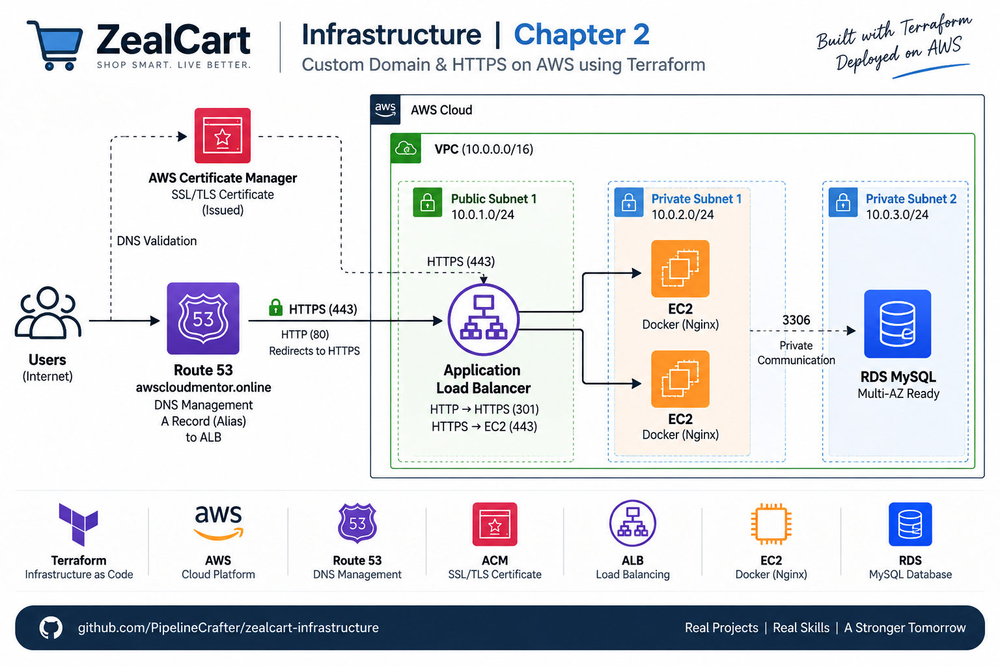

# 🚀 ZealCart Infrastructure

Production-style AWS infrastructure built with modular Terraform featuring High Availability, Route 53, ACM, HTTPS Load Balancing, Auto Scaling, Bastion Administration and Amazon RDS MySQL.

## 🏗 Architecture

- VPC with Public & Private Subnets
- Internet Gateway & NAT Gateway
- Route 53 Public Hosted Zone
- AWS Certificate Manager (ACM)
- HTTPS Application Load Balancer
- HTTP → HTTPS (301 Redirect)
- Auto Scaling Group & Launch Template
- Bastion Host for secure SSH access
- Amazon RDS MySQL (Private Subnets)
- Security Group based communication

## ☁ AWS Services Used

- Amazon VPC
- Amazon EC2
- Auto Scaling Group
- Elastic Load Balancer (ALB)
- Route 53
- AWS Certificate Manager (ACM)
- Amazon RDS (MySQL)
- IAM
- NAT Gateway
- Route Tables
- Security Groups

## Project Structure

modules/
├── acm/
├── alb/
├── asg/
├── bastion/
├── bastion_security_group/
├── db_subnet_group/
├── ec2_security_group/
├── iam/
├── launch_template/
├── listener/
├── nat/
├── private_route_table/
├── rds/
├── rds_security_group/
├── route53/
├── route_table/
├── subnets/
├── target_group/
└── vpc/

## 🎯 Learning Outcomes

- Modular Terraform Architecture
- Route 53 DNS & Hosted Zones
- ACM DNS Validation
- HTTPS Load Balancer Configuration
- HTTP → HTTPS (301 Redirect)
- Security Group Least Privilege Design
- Auto Scaling with Launch Templates
- Private RDS Deployment
- Docker Bootstrap using User Data

## ✨ Production Features

- High Availability across 2 Availability Zones
- Custom Domain (Route 53)
- SSL/TLS Encryption using ACM
- HTTPS-only public access
- Automated DNS Certificate Validation
- Infrastructure as Code with reusable Terraform modules
- Dockerized application bootstrap

## Author

**Abdul Khadar Zeelan**  
DevOps Engineer | AWS | Terraform
